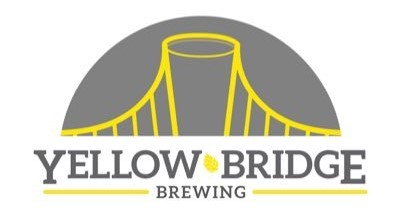

## A homebrewing club that is based in Westmoreland County, Pennsylvania.

### Who we are...

The Westmoreland Area Zymology Enthusiasts (WAZE) is a homebrew club that is based out of Westmoreland County in Pennsylvania.
No membership required, just attend a meeting and you're in!

### Next Meeting

Our next meeting is at Yellow Bridge Brewing on April 10th at 7PM. Come a little early to enjoy the fine beverages Yellow Bridge has to offer. Bring your homebrew for tastings and feedback!

### Register for our upcoming competition!

Our 2019 Fizzy Yellow Beer Cup is approaching quick. Go [here](http://wazecomp.jcbweb.com) and register your beers. You can also sign up to volunteer as a judge or a steward.

### Buy a shirt!

We have shirts available [here](https://shop.spreadshirt.com/wazebrew/).

### Contact us

You can email us for more information or go to our Facebook page.



### Subscribe to our mailing list

Want to get updates on meetings, events, or anything else? Enter your email below to be added to our mailing list.

<!-- Begin Mailchimp Signup Form -->
<link href="//cdn-images.mailchimp.com/embedcode/slim-10_7.css" rel="stylesheet" type="text/css">

<form action="https://google.us18.list-manage.com/subscribe/post?u=2f7d15b6d700874d4f3a37959&amp;id=6d30ef5875" method="post" id="mc-embedded-subscribe-form" name="mc-embedded-subscribe-form" class="validate" target="_blank" novalidate>
    

	<label for="mce-EMAIL"></label>
	<input type="email" value="" name="EMAIL" class="email" id="mce-EMAIL" placeholder="email address" required>
    <!-- real people should not fill this in and expect good things - do not remove this or risk form bot signups-->
    
<input type="text" name="b_2f7d15b6d700874d4f3a37959_6d30ef5875" tabindex="-1" value="">

    
<input type="submit" value="Subscribe" name="subscribe" id="mc-embedded-subscribe" class="button">

    

</form>

<!--End mc_embed_signup-->

